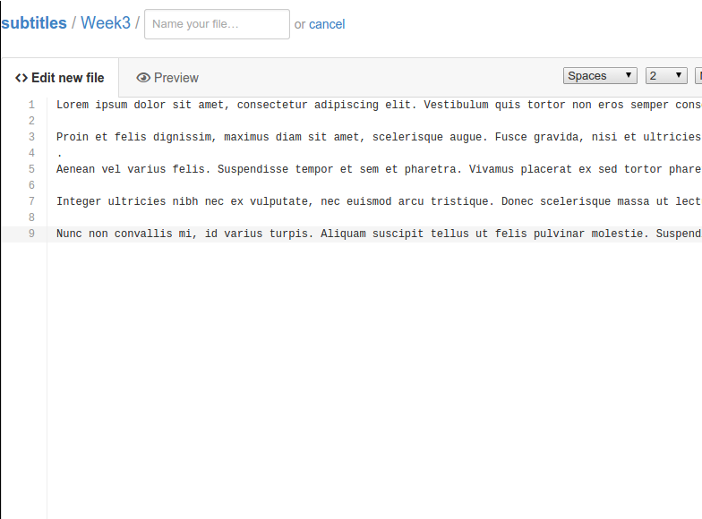
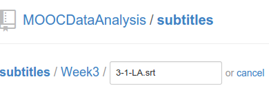
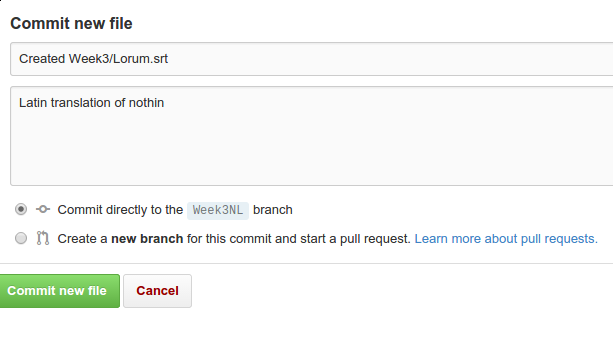

# Subtitles
All subtitles for the EX101x MOOC can be found here.

## Adding a translation to this repository
If you are interested in adding a translation to this repository, please follow
the steps below. If you are interested in proposing a fix to existing subtitles,
please check the section on [fixes](#fixing-a-translation-in-this-repository).

To add a new translation to this repository, two situations are possible. Either
we have already created branches for you to fill with the subtitles, or no such
branches exist yet. If you are unsure whether we have created them, you can
check by clicking on the dropdown menu that says "branch: master". You will get
options like this:

If there is a branch called "WeekXYY" where X is the week number and YY is the
abbreviation of the language you want to add (e.g. NL for Dutch) than a branch
already exists and you can [add your work
there](#adding-your-work-to-an-existing-branch) If no such branch exists, you
will have to [create one yourself](#adding-your-work-to-a-new-branch).

### Adding your work to an existing branch

Assuming a branch exists, click the "branch button" at the top of the screen:

Select the branch you want to upload your work to:

You have now changed to the correct branch.

#### Uploading content in this branch

Now go to the folder you want to upload your content in:

Hit the "+" button to create a new file:

Fill the file with your content:

Name the file properly, we use X-Y-ZZ.srt where X is the week number, Y is the lecture number and ZZ is the language abbreviation (e.g. 1-3-EN.srt) : 

Add a "commit message" telling us what you have added:

Click "Commit new file":

Congratsulations your changes have now been committed to this branch! In order for them to be reviewed and accepted you will have to [open a pull request](#opening-a-pull-request)

### Adding your work to a new branch 
Go to the folder you want to upload your content in:

Hit the "+" button to create a new file:

Fill the file with your content:

Name the file properly, we use X-Y-ZZ.srt where X is the week number, Y is the lecture number and ZZ is the language abbreviation (e.g. 1-3-EN.srt) : 

Add a "commit message" telling us what you have added:

Be sure to click: "Create a new branch for this change and open a new pull request" and fill in a sensible name for the branch (for instance: Week3LA) :

Click "Commit new file":

Congratsulations your changes have now been committed to a new branch! Future additions in the same topic can be done in the same branch using [the description above](#adding-your-work-to-an-existing-branch). In order for them to be reviewed and accepted you will have to [open a pull request](#opening-a-pull-request).

### Opening a Pull Request

