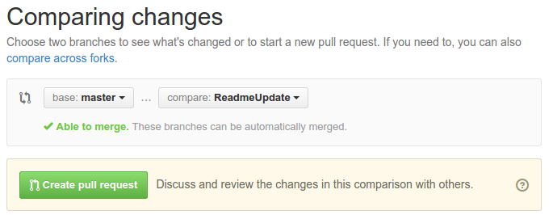
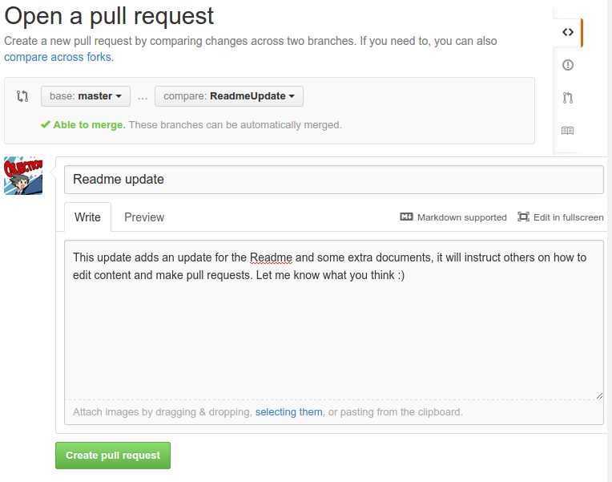

# Creating a Pull Request (PR)

In order to have your changes merged into our `master` branch, you will have to
submit a pull request. We will then review your changes or new subtitles and
give you some feedback. You might have to [make some
changes](./submittingFixes.md) before we accept your pull request.

[Switch to the branch](./switchingBranches.md) you want to have merged into our
master using the branch button. Having done that click the green button next to
the switch branch button:

Check your changes and click the button to continue.

Fill in a proper title and a clear message explaining what you mean to add.

Finally open the pull request and get ready for some feedback.

