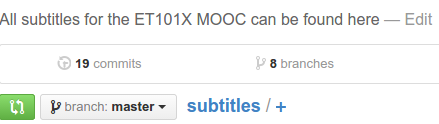
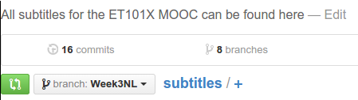

# Switching Branches

Assuming a branch exists, click the "branch button" at the top of the screen:

Select the branch you want to upload your work to:

You have now changed to the correct branch.

