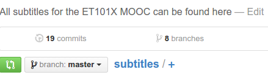
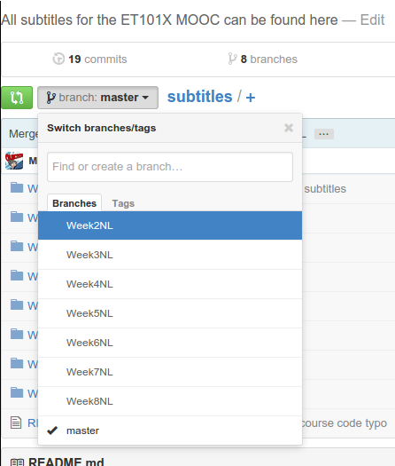
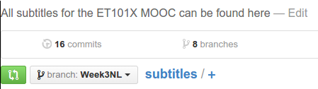
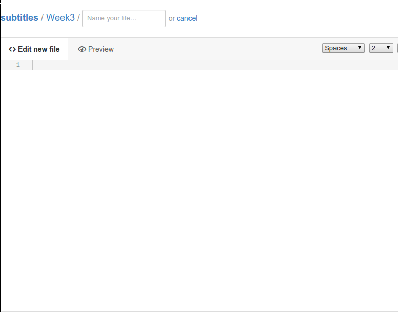
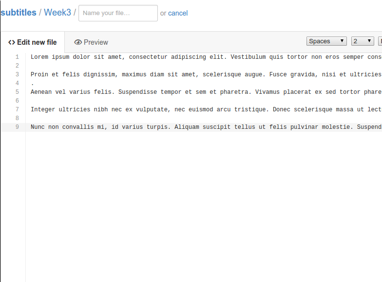
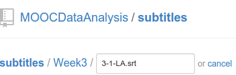

### Adding your work to an existing branch

Assuming a branch exists, click the "branch button" at the top of the screen:

Select the branch you want to upload your work to:

You have now changed to the correct branch.

#### Uploading content in this branch

Now go to the folder you want to upload your content in:

Hit the "+" button to create a new file:

Fill the file with your content:

Name the file properly, we use X-Y-ZZ.srt where X is the week number, Y is the lecture number and ZZ is the language abbreviation (e.g. 1-3-EN.srt) : 

Add a "commit message" telling us what you have added:

Click "Commit new file":

Congratsulations your changes have now been committed to this branch! In order
for them to be reviewed and accepted you will have to [open a pull
request](./pullRequest.md).
