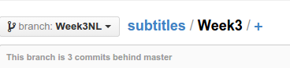
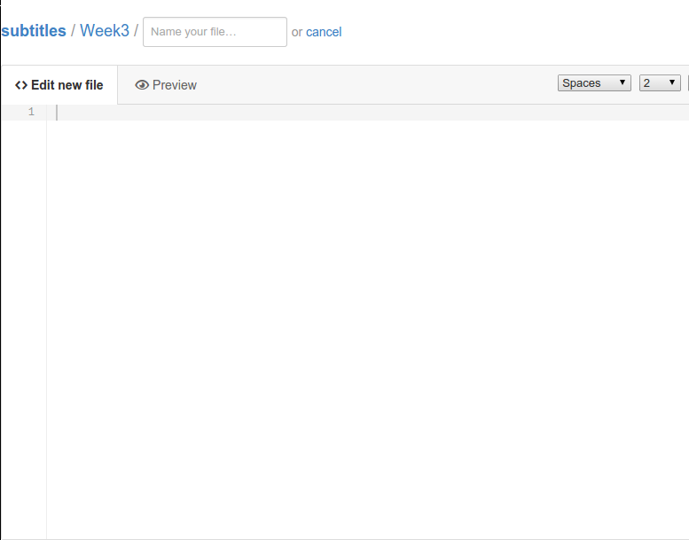
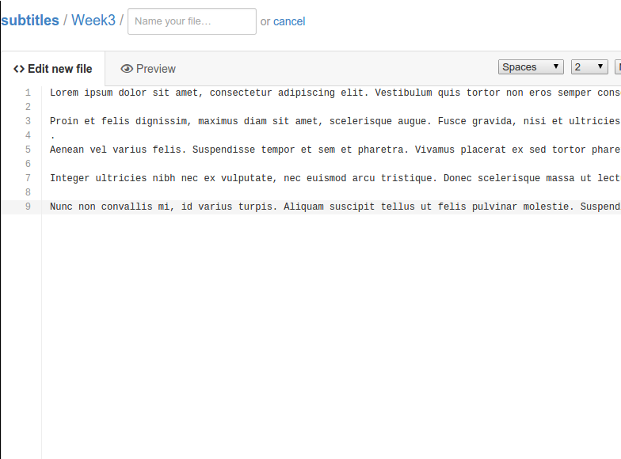
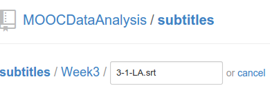
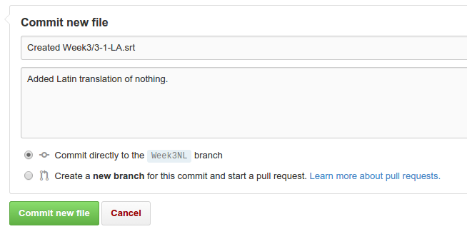
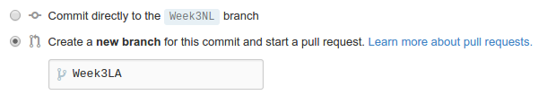

# Adding your work to a new branch 
Go to the folder you want to upload your content in:

Hit the "+" button to create a new file:

Fill the file with your content:

Name the file properly, we use X-Y-ZZ.srt where X is the week number, Y is the lecture number and ZZ is the language abbreviation (e.g. 1-3-EN.srt) : 

Add a "commit message" telling us what you have added:

Be sure to click: "Create a new branch for this change and open a new pull request" and fill in a sensible name for the branch (for instance: Week3LA) :

Click "Commit new file":

Congratulations your changes have now been committed to a new branch! Future
additions in the same topic can be done [in the same branch](./existingBranch.md).
In order for them to be reviewed and accepted you will have to [open a pull
request](./pullRequest.md) to our master branch.

